# PayUApp

A modern personal finance app built with React Native and Expo for tracking income, expenses, balances, and account insights.

## Overview

PayUApp helps users:

- Add and manage income/expense transactions
- Monitor monthly balance trends
- View category-level spending insights
- Switch between dark and light themes
- Access a polished, mobile-first dashboard experience

## Tech Stack

- React Native (0.81)
- Expo (SDK 54)
- TypeScript
- React Navigation (Stack + Bottom Tabs)
- AsyncStorage (local persistence)
- Expo Linear Gradient
- React Native Gifted Charts

## Features

- Authentication flow:
  - Sign In / Sign Up screens with validation
- Home dashboard:
  - Total balance card with monthly context
  - Income vs spent snapshot
  - Quick action shortcuts
  - Recent transactions list
- Balances analytics:
  - Credit score gauge
  - Monthly spending chart
  - Expense breakdown pie chart
  - Transaction filter tabs (All / Income / Expense)
- Transaction management:
  - Add income or expense with category picker
  - Quick amount shortcuts
  - Long-press delete with confirmation
- Profile:
  - Account preview and edit mode
  - Summary stats (income / spent / balance)
  - Sign out flow
- UX polish:
  - Scroll-aware floating action button (FAB)
  - Theme persistence (dark/light)
  - Smooth transitions and card interactions

## Project Structure

```text
src/
  components/
  context/
  navigation/
  screens/
  theme/
  utils/
```

## Setup Instructions

### 1. Prerequisites

- Node.js 18+
- npm 9+
- Expo Go app on Android/iOS (for device testing)

### 2. Install Dependencies

```bash
npm install
```

### 3. Start Development Server

```bash
npm run start
```

### 4. Run on Target Platform

```bash
npm run android
npm run ios
npm run web
```

Notes:

- `ios` requires macOS for simulator builds.
- On physical devices, scan the QR code from Expo CLI using Expo Go.

## Screenshots

### Auth

| Login                                   | Signup                                    |
| --------------------------------------- | ----------------------------------------- |
| 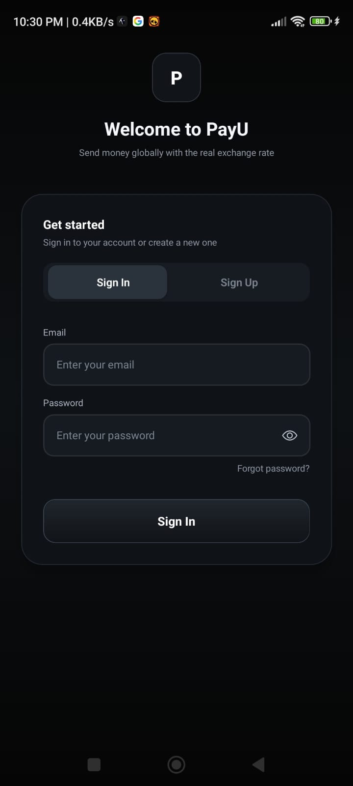 | 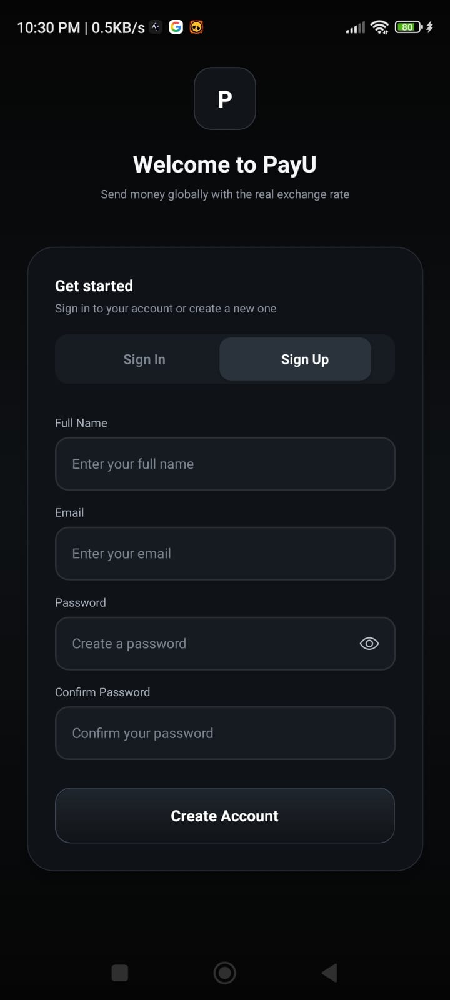 |

### Home Dashboard

| Dark - Dashboard 1                               | Dark - Dashboard 2                               | Light - Dashboard                                   |
| ------------------------------------------------ | ------------------------------------------------ | --------------------------------------------------- |
| 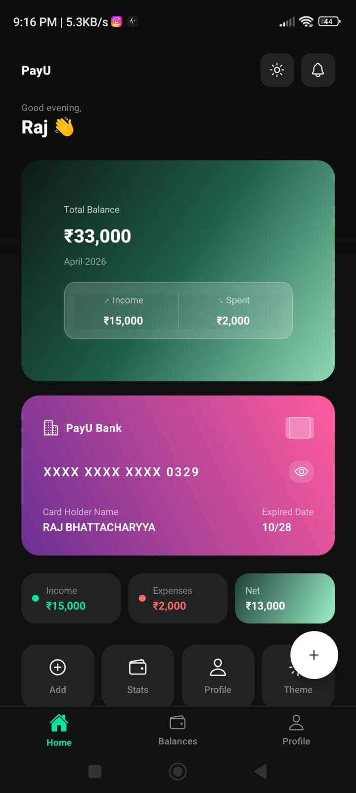 | 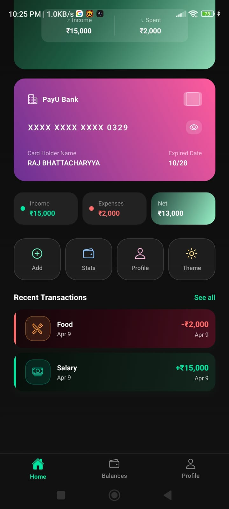 | 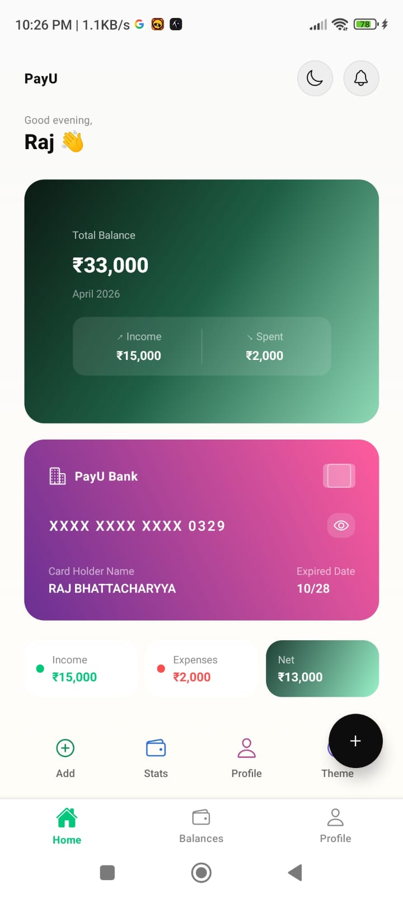 |

### Balances

| Dark - Balances 1                             | Dark - Balances 2                             | Light - Balances                                 |
| --------------------------------------------- | --------------------------------------------- | ------------------------------------------------ |
| 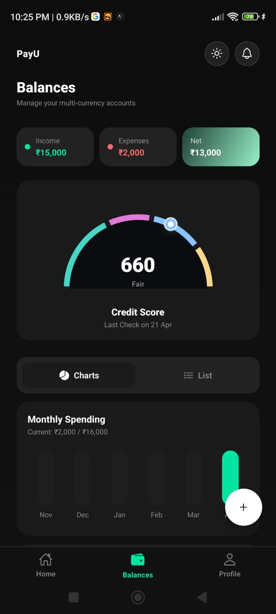 | 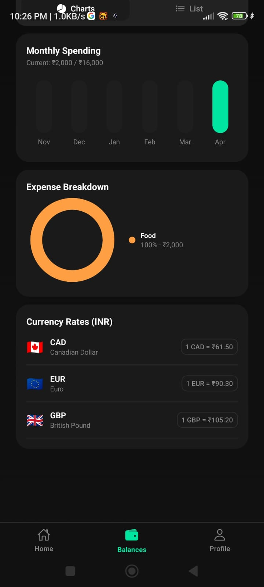 | 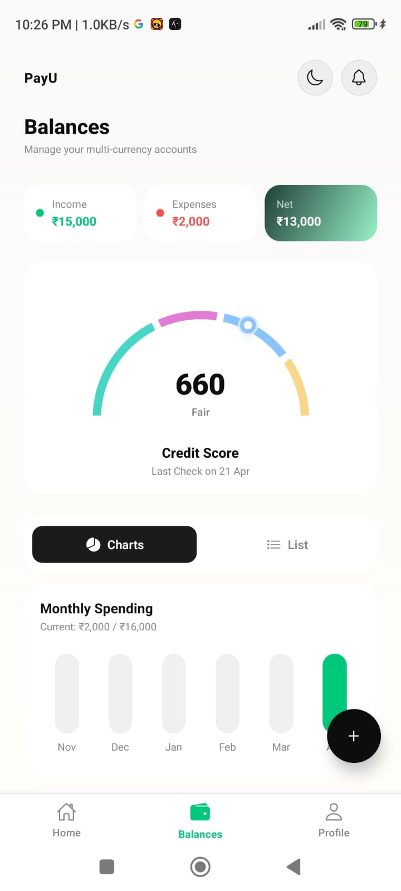 |

### Add Transaction

| Add Transaction - 1                                         | Add Transaction - 2                                         |
| ----------------------------------------------------------- | ----------------------------------------------------------- |
| 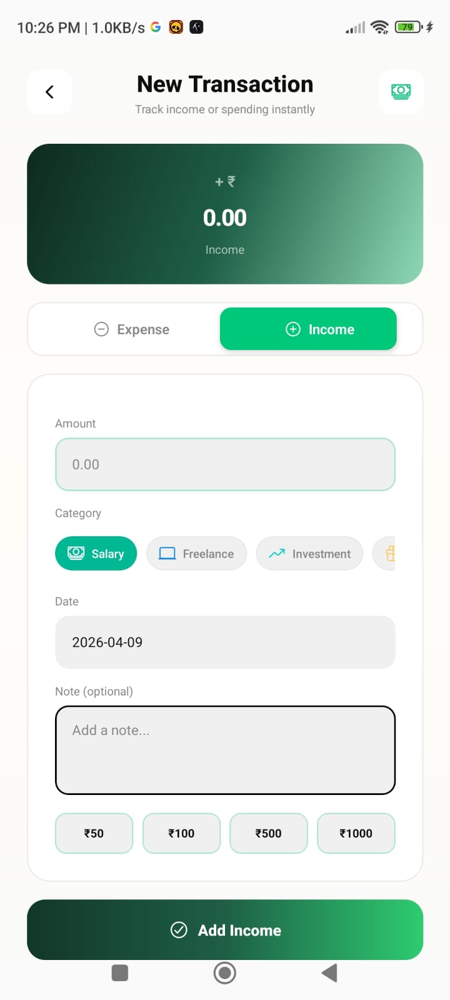 | 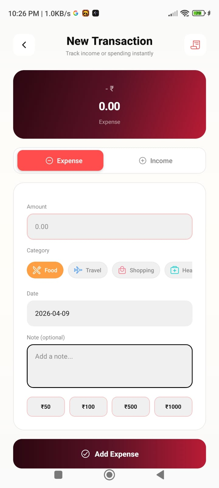 |

### Profile

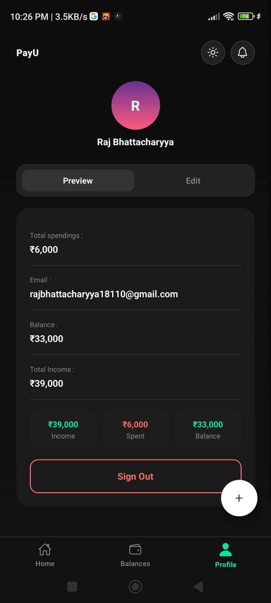

## Available Scripts

- `npm run start` - Start Expo dev server
- `npm run android` - Open app on Android
- `npm run ios` - Open app on iOS simulator
- `npm run web` - Open app in web browser

## Data & Storage

The app stores user/auth/theme/transactions locally using AsyncStorage. No backend is required for local development.

## License

This project is for educational and development use.
